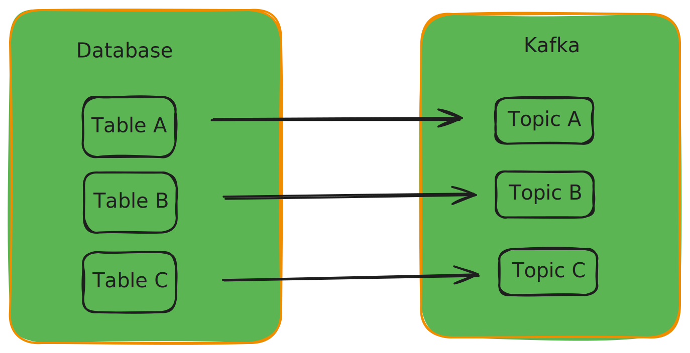
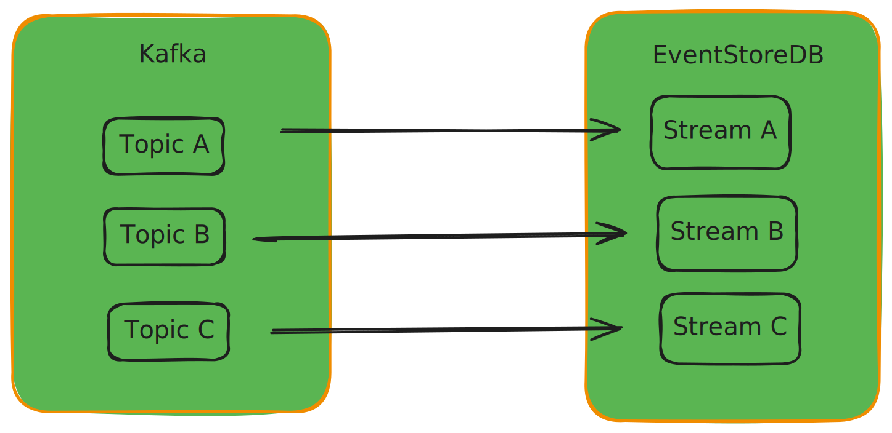
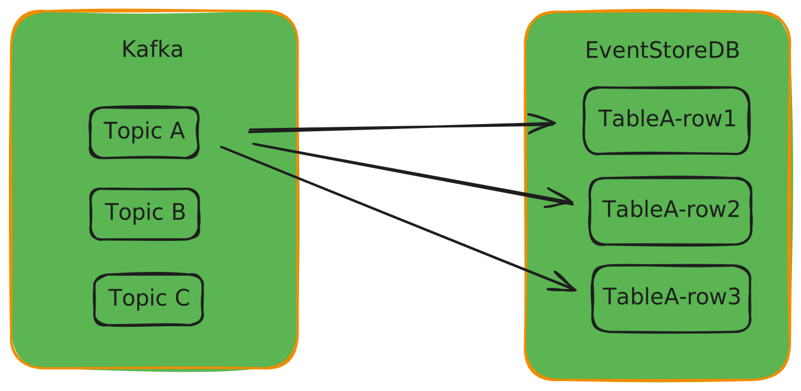
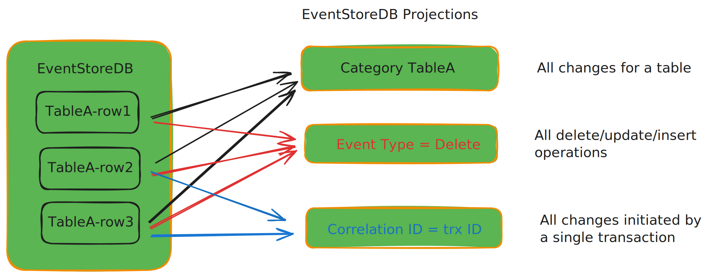

# Using EventStoreDB in CDC(Change Data Capture) pipelines

## Introduction

Moving data from operational data stores into data warehouses, lakes, or lakehouses is a standard business requirement for organizations of all sizes.

Implementing a CDC pipeline using Debezium is a widely recognized and efficient process for this task.

Debezium translates Change Data Capture (CDC) events from various sources into a common format, allowing those events to be ingested by multiple destinations, including data lakes, lakehouses, NoSQL stores, and more.

Including EventStoreDB as a destination or hub in CDC pipelines provides many benefits and complements Debezium in these use cases.  By taking advantage of EventStoreDB’s immutable storage, fine-grained streams, and native projection and subscription capabilities, organizations gain more insight into their data than possible with traditional CDC methods.  

### Resources

This repo provides:

1. Use case summary
2. Instructions to launch a Docker-based MySQL to EventStoreDB pipeline using Debezium
3. Code example that reads from Kafka and publishes to EventStoreDB
4. Code examples that perform statistical analysis by reading from EventStoeDB streams and projections
5. SQL scripts that modify the MySQL database to trigger change events in the CDC pipeline

**Additional repo information:**

* Start by reading the " docker_scripts " README.  This folder contains a collection of shell scripts that launch a series of Docker containers to implement the CDC pipeline.
* The “sql” folder contains example SQL scripts that modify the MySQL database with changes that are picked up by the CDC pipeline 
* The “python” folder contains:
   1. Python code to read from Kafka topics and write to EventStoreDB
   2. Python code to read streams produced by EventStoreDB’s projection engine
   3. Python code for some basic data visualizations using pandas


### Benefits of EventStoreDB in CDC pipelines

Using EventStoreDB as a sink or hub in your data redistribution workflow has the following benefits:

1. EventStoreDB provides an immutable log of CDC events
2. Enhanced ability to subscribe to the fine-grained, per-row Event Streams.
3. The EventStoreDB projection engine can create views or subscriptions to aggregations of events, including aggregate by SQL operation, transaction ID, and database table.
4. Subscribing to CDC events after they land in EventStoreDB, with granular control over which subset of events to subscribe to, allows EventStoreDB to function more like a hub that advances data transformation.  It also ensures an immutable log's necessary data retention and audit trail capabilities.
5. Ordered and durable events provide options to reprocess, audit, and analyze as needed.


## Architecture of typical Debezium-based CDC pipeline

At a high level, the basic architecture involves these tools


A more granular view of the tools, showing required supporting features and products


## Lifecycle of a CDC event (MySQL -> EventStoreDB)

Whenever data is modified in the source database by a create (insert), delete, or update statement, one or more CDC events will propagate through the pipeline. This example will use a single-row insert. 

### Step 1. The database server, MySQL or MariaDB, writes the event to its binlog

The binlog is used for database replication.  The binlog is usually enabled by default; when enabled, all changes to the database are logged into the binlog.  The setting **gtid_mode=ON** must be set to get transaction IDs logged into the binlog.  See 03_mysql.sh in the docker_scripts directory in the GitHub repo for a code example that starts a Docker container running MySQL with this setting enabled in the startup script. 

### Step 2. Debezium picks up the data change event from the binlog

In this example, Debezium impersonates the role of another MySQL instance that would act as a replica for backup or scaling reads. The server-id setting is significant for this process. Setting unique server-ids is critical when fanning out multiple replicas with multiple Debezium instances reading the binlog of a single MySQL instance.

### Step 3. Debezium transforms the binlog event into a standard CDC event and posts the event to a Kafka topic

There will be one Kafka topic per table. In the example repository, the code that reads from Kafka only subscribes to three topics/tables.

Typically, once a message has been consumed, the consumer informs Kafka not to resend that message to this consumer group
 ```'enable.auto.commit': 'true'```. Setting this to false can be useful to debug the code that processes messages. 

When you restart your code, you will not have to generate new messages in the pipeline. The code will reread the same messages each time it is restarted. The Python code kafka_consumer_demo.py sets  ```'enable.auto.commit': 'false’```.   Running this code will not delete messages meant to be consumed by kafka_reader_ESDB_writer.py.

### Step 4. Python(or other language) application consumes Kafka messages and writes them to EventStoreDB

With change events being propagated to a Kafka topic per table, the remaining step is to read the Kafka messages and write to EventStoreDB as events appended to a stream.


## Mapping of database tables to Kafka topics

Debezium will create one Kafka topic per table. When a row is changed in a table, a message will be created for the corresponding topic.




## Mapping Kafka topics/messages to EventStoreDB streams

The next step is to get messages from Kafka topics into EventStoreDB streams.

But first, here is a quick review of EventStoreDB functionality.

1. EventStoreDB stores immutable events in an append-only log.
2. When appending an event, the following are specified:
   a. Stream name
   b. Event type
   c. Event data
   d. Event metadata
   
3. External applications can subscribe to a stream or streams.

Considering EventStoreDB’s features, the following are stream design options you may consider when writing CDC messages into EventStoreDB as events.  

## One stream per topic/table

This configuration is relatively straightforward. The code may choose to extract a field from the Kafka payload and use it to set “Event Type,” or it could more or less ingest the unaltered message content.

The immutable audit log functionality of EventStoreDB is preserved, the ordering of events is maintained, and clients can subscribe to changes for a particular table.




## One stream per row

The code example in the provided GitHub repository demonstrates this configuration. The following event features are set by parsing the topic or the message's payload.

### 1. Stream Name is set to TableName-rowid

As a message is consumed from the Kafka topic associated with the table, it is parsed, and the row identifier for the changed row is extracted and used as the second part of the Stream Name for the event. ```TableA-row1```,for example.

### 2. Event Type is set to SQL operation

The message payload is parsed to extract the SQL operation: delete, insert(create), update, or snapshot (initial read), and Event Type is set to that value.

### 3. Correlation ID is set to transaction ID

A single transaction may modify more than one row. If GTID (global transaction IDs) are enabled on the MySQL server, Debezium will pick up that value and include it in the message payload. In the code example, that value is extracted and becomes part of the event’s metadata.

### The diagram illustrates this design

A single transaction may modify more than one row. If GTID (global transaction IDs) are enabled on the MySQL server, Debezium will pick up that value and include it in the message payload. In the code example, that value is extracted and becomes part of the event’s metadata.



To keep the diagram concise, only one table's row changes are diagrammed. Many streams are created per table, and including each would quickly make a crowded image.

Since the relationship between SQL table events and streams diverges in this configuration, it might be helpful to describe an example.

If a row is created and never modified, a stream in EventStoreDB will have a single event with an Event Type “Create.”

If a row is created, updated once, and then deleted, there will be a stream in EventStoreDB with three events:   
   1. Event Type Create
   2. Event Type Update
   3. Event Type Delete

## Leveraging the EventStoreDB projection engine

EventStoreDB’s built-in projection engine can be extremely useful to enable applications, systems, data scientists, or other data users to subscribe to changes across an aggregation of streams.

Events from one stream may be projected into another stream. For further review, please visit Event Store’s
 [projections](https://developers.eventstore.com/server/v5/projections.html#system-projections) documentation.

Enabling all projections on the EventStoreDB server provides the following functionality.

* Subscribe to changes for all rows in a table
* Subscribe to a stream of all updates, inserts, or deletes across all tables
* View all rows affected by a single transaction

The following is a visualization of EventStoreDB projections as applied to CDC events.



## Summary

This document introduced some functionality EventStoreDB can add to your CDC pipelines. With EventStoreDB’s immutable storage, fine-grained streams, and native projection and subscription capabilities, organizations can derive more insight from their data than possible with traditional CDC methods.  
There is more to this repository if you would like to explore it.

## Additional Learning Options

### Shell scripts to build a Docker-based CDC pipeline

You can build a proof-of-concept (POC) model by running the shell scripts in the docker_scripts folder of the GitHub repository. 

The README.md in that folder explains the “how” and the “why” of each pipeline component. 
There are many Docker instances that utilize a fair amount of resources. It is advised to kill all Docker containers and restart from scratch rather than restart individual containers. 

If you have issues running the instances in your environment, please file an issue.

### SQL scripts to modify a MySQL database to create events for the pipeline

The sql folder has scripts that add rows to the database, update rows, delete rows, and one that performs a mix of deletes and inserts. 

Running these scripts will generate events in the CDC pipeline.

### Python code to process the Kafka messages into EventStoreDB events

The python folder contains code that reads from the Kafka topic and writes to EventStoreDB in a continuous loop. 

Before you run any of the code, please read the README file. The README describes what you should expect to see in EventStoreDB after running the kafka_reader_ESDB_writer.py program and which SQL scripts to run to see additional events. 

The python folder also contains: 
* Code that demonstrates a subscription to a Kafka topic
* Code that reads from streams generated by the EventStoreDB projection engine to calculate statistics and visualizations

If you have trouble running the Python code locally, see Event Store’s “Python From Scratch” repository for advice on setting up your local Event Store Python code environment.

### Example visualizations of statistical analysis

The examples_of_analysis_plots folder contains plots generated by analysis_by_sql_operation.py and analysis_of_rows_per_transaction.py. These plots are included as quick analysis examples that EventStoreDB enables using projections for users who choose not to run the code themselves.

------------------------------
