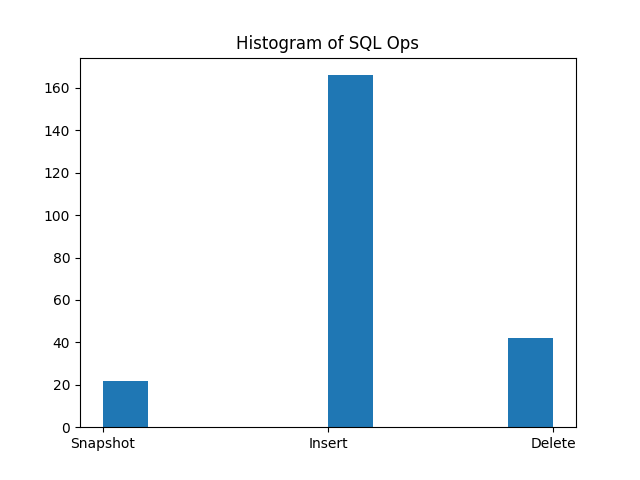
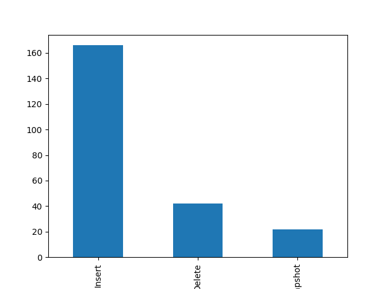
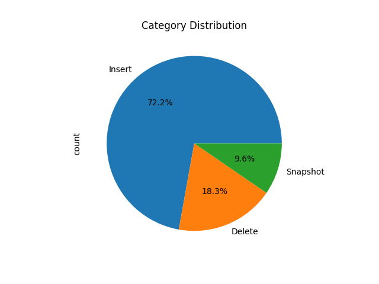

# Examples of Analysis Enabled by EventStoreDB and projection Engine

In the python folder there are two programs that read from streams generated by the CDC pipeline and perform statistical analysis in pandas.

1. analysis_by_sql_operation.py
2. analysis_of_rows_per_transaction.py

Running those programs generates the plots seen here.

More complex analysis could be done, but this demonstrates the utility of having EventStoreDB as part of your CDC pipeline. 

