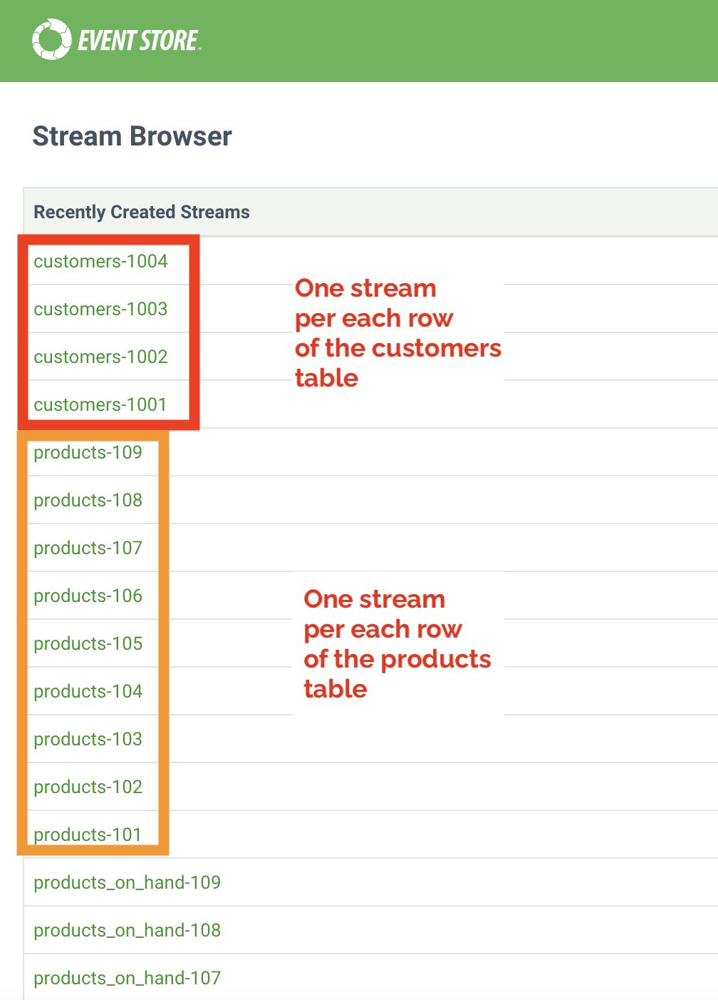
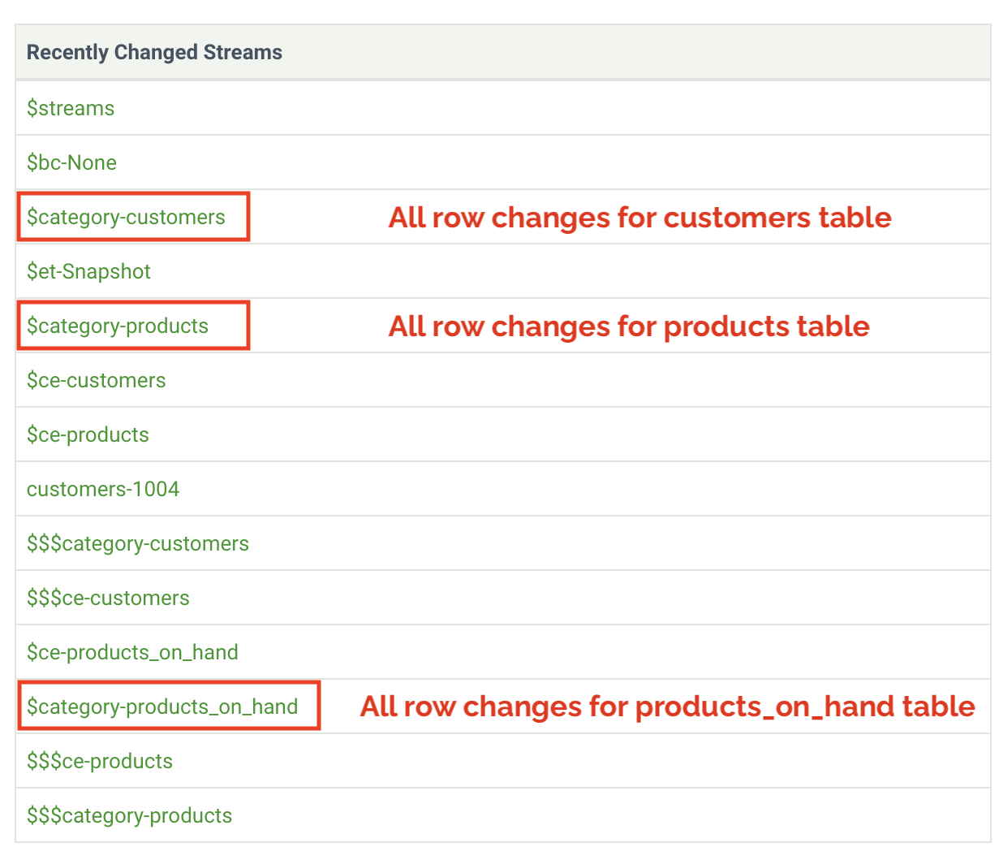
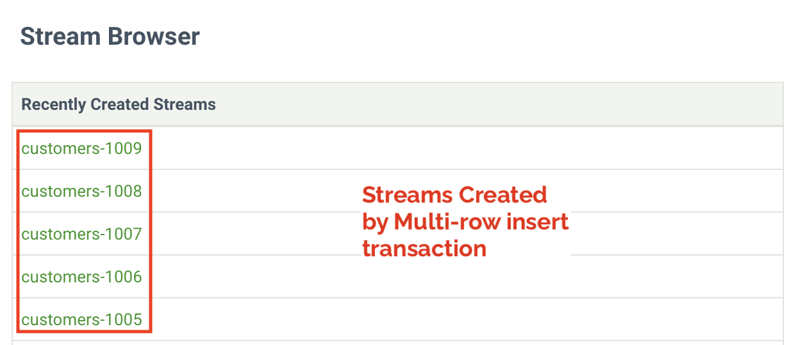
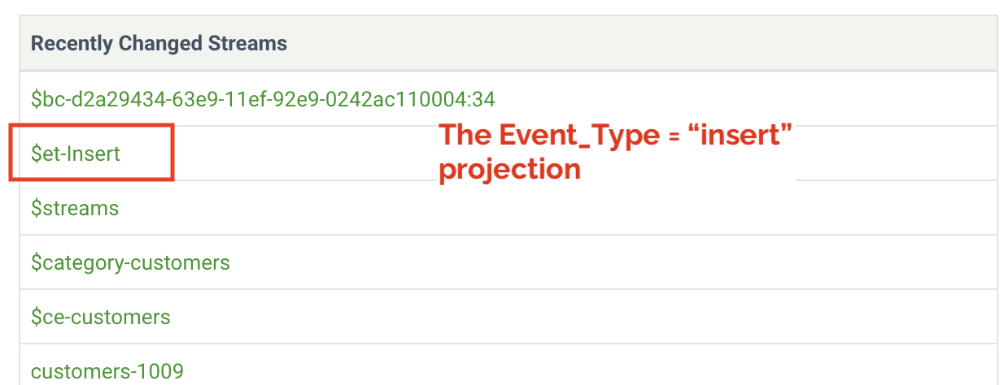
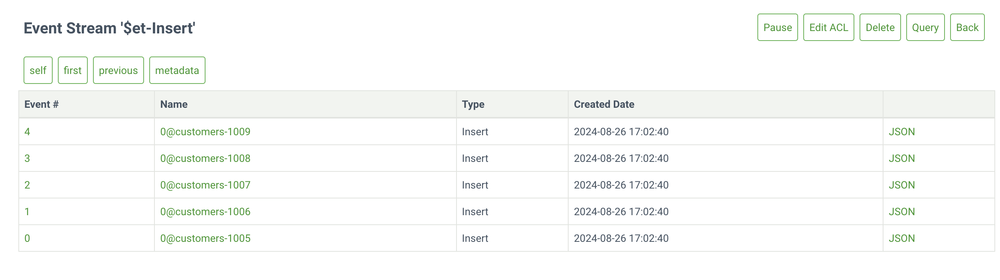
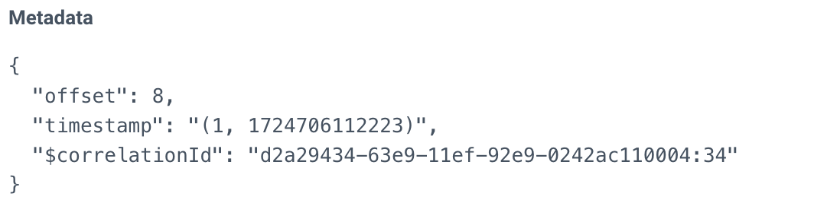
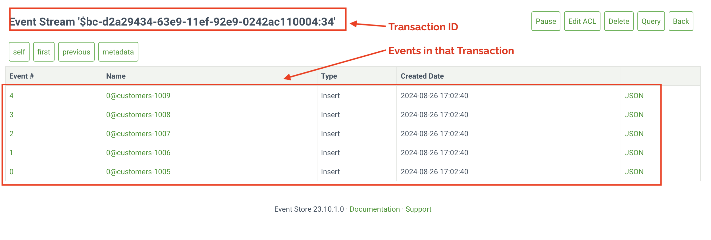

# Exploring the Code Example

*** WARNING: If you encounter issues with rendering the plots, this code runs successfully in Python 3.11.9 *** 

The provided code expects that you have a running CDC pipeline that feeds Change Events from MySQL through Debezium and into Kafka topics.

The configuration of this pipeline is described in the README in the docker_scripts folder. 

The code examples for reading from a Kafka topic could easily be modified for other use cases where Kafka data is appended into EventStoreDB.

The examples on EventStoreDB system projections and reading from the projections to complete statistical analysis in pandas could also be modified for other use cases.

## Shell scripts to build a pipeline

It is assumed that you have started the Docker containers in the correct order, as illustrated below.  Please check the docker_scripts folder for additional information.  

The shell scripts:
* 01_zookeeper.sh
* 02_kafka.sh
* 03_mysql.sh
* 04_mysql_CLI.sh
* 05_kafka_connect.sh
* 06_deploy_connector.sh
* 07_topic_watcher.sh
* 08_start_cluster.sh

## SQL scripts to modify a MySQL database to create events for the pipeline

The MySQL database has been prepopulated with a few rows of data. Those rows will be read as "snapshot" events and appear per table in the Kafka topic.

SQL scripts located in the 'sql' directory add or delete rows from tables in the MySQL database running in the Docker container. Running those scripts sends CDC events through the CDC pipeline and into EventStoreDB.

Much of the code in this directory assumes that you can send CDC events through the pipeline to EventStoreDB by running those SQL scripts. 

## Python code to process the Kafka messages into EventStoreDB events

The 'python' folder contains examples of Python code that reads from Kafka and writes to EventStoreDB.

If you have trouble running the Python code locally, see Event Store Educational Services' [Python From Scratch](https://github.com/EventStore/EventStoreDB-From-Scratch-Python)Repository for advice on setting up a local Event Store Python code environment. 

The code in the GitHub repo provides examples of writing a stream per row and reading from the projections to build visualizations.


### python virtualenv (venv) and requirements.txt

Your IDE may prompt you to enable the venv and automatically run ```pip install -r requirements.txt``` within that venv.

If not, see the [Python From Scratch](https://github.com/EventStore/EventStoreDB-From-Scratch-Python) repository to work through that example, perhaps first in GitHub codespaces, which we test regularly. Then, run that example locally. It has fewer dependencies, a single Docker container (this one has many), and it is completely documented for the beginner. Getting that working will get you through the learning curve of getting this one set up.

### Description of the programs in this folder

* kafka_reader_ESDB_writer.py

This code reads from the Kafka topic to generate events appended to EventStoreDB.

It runs in a continuous loop but can be stopped with ```ctrl-c``` in the terminal.

* kafka_consumer_demo.py

This is a simple demo of creating a Kafka consumer in Python that reads from one or more topics.

This is configured to NOT delete messages after consuming them.  It can be run multiple times and display the same messages to the terminal. It can test whether the CDC events are making it to Kafka. It could also be modified for any use case where you need to read from Kafka using Python.

* read_all_events_per_table.py

Instead of writing the CDC pipeline's Kafka topic to a single stream, the code in this example parses the Kafka message, extracts the rowid, and appends that event to an EventStoreDB stream per row.

This code reads from EventStoreDB's built-in ```By_Category``` projection, which enables a reader to read or subscribe to all changes for a table.

* read_all_events_for_a_single_transaction.py

This code leverages the ```correlationID``` projection, another of EventStoreDB's built-in projections.

Our Event Writer code extracts the GTID (global transaction ID) from the Kafka payload and writes that into the Events metadata as ```correlationID``` 

* analysis_by_sql_operation.py

This code reads from EventStoreDB's ```EventType``` projection.

Events are read and placed into a pandas DataFrame for simple analysis. 

This helps illustrate how EventStoreDB in your CDC pipeline allows CDC events to be organized in a way that is well-suited to statistical analysis and machine learning.

The analysis.... examples generate images of pie charts, bar graphs, and histograms. Examples of those are stored in the examples_of_analysis_plots directory. Please feel free to take a look at these if you are not interested in setting up the entire Docker pipeline.

This code becomes more interesting after running the many_changes.sql script.

* analysis_of_rows_per_transaction.py

This example reads all changes from the 'customers' table and gathers correlationIDs (transaction IDs) into a pandas DataFrame. The pandas DataFrame generates statistics on the median, maximum, and minimum number of rows per transaction.

This type of analysis can help determine whether developers interacting with the database efficiently use transactions in their code. 

If you do not wish to run the code, examples of the output are available in the examples_of_analysis_plots folder.

This code becomes more interesting after running the many_changes.sql script.

## Running the demo

After starting all Docker containers in order, you should have a working Debezium CDC pipeline.

Running the Python program 'kafka_reader_ESDB_writer.py' will capture the initial snapshot events and write them to EventStoreDB streams. The program runs in a continuous loop.  Hit ctrl-c to stop the process.

After running the program, you can look at MySQL and the EventStore stream browser to confirm the row data from MySQL has been replicated as event data in EventStoreDB.

For reference, here is a view of MySQL:

```
mysql> show tables;
+---------------------+
| Tables_in_inventory |
+---------------------+
| addresses           |
| customers           |
| geom                |
| orders              |
| products            |
| products_on_hand    |
+---------------------+
6 rows in set (0.04 sec)
```

Although Debezium captures all six tables, our consumer code only consumes three.

```
c.subscribe(['dbserver1.inventory.customers','dbserver1.inventory.products','dbserver1.inventory.products_on_hand'])
```

On startup, Debezium captures a snapshot of existing rows.  The first read of the consumer will get events labeled as "snapshot" events for each row of the customers, inventory, and products_on_hand tables.

Viewing the [stream browser](http://localhost:2113/) illustrates these rows have been appended into individual streams as events with the type "Snapshot."
<br />
<br />


<br />
<br />

## Using EventStoreDB's built-in projection system

If the projection subsystem is enabled and projections are running, you can view the projection streams. This is configured by the shell script that starts the EventStoreDB Docker container. If you use an alternate method to start EventStoreDB, you may need to enable them. 

In this scenario, changes to row 1 of the 'customers' table will be written to stream customers-row1.

The category projection will split the stream-name on the ```-``` character and put all events to all streams that start with ```customers``` into the ```$category-customers``` stream. There is Python code to read from that projection. See ```read_all_events_per_table.py``` in the python directory. 



<br />
<br />

## Processing of Inserts

After the initial snapshot is taken, Data Change events resulting from inserts, updates or deletes will be appended to the stream for that row.

In the sql folder, the script ```add_customers.sql``` will add five records to the 'customers' table in a single transaction.

The table has a unique constraint on email, so a second execution of this script will NOT add new rows.

If you run the script ```sh sql/add_customers.sql ```, you will see that the streams listed below have been created.

This assumes ```kafka_reader_ESDB_writer.py``` is running.  If you stop it, restart it, and it will pick up the new events from Kafka.

After running the SQL script, the EventStoreDB stream browser should show five new streams, one per row inserted into the 'customers' table.



## Event Type projection

Adding five rows in an insert operation means five events are written to EventStoreDB with an EventType of "Insert".

The Event Type projection for "Insert" will contain those rows.

These can be viewed in the [stream browser](http://localhost:2113/web/index.html#/streams/$et-Insert).

If you want to read or subscribe to that projection, you can use the ```read_all_events_per_table.py``` code or the analysis_by_sql_operation.py as examples.

### Event Type Projections for this CDC example

The code creates events with one of the following types:

* Snapshot
* Insert
* Update
* Delete

Streams and projections are created when the first event of that type is written.  Events will be appended to the projections as subsequent events of that Event Type are appended to EventStoreDB.

The projection feature adds significant flexibility to CDC pipelines. Applications can subscribe to or read the projections entirely based on Event Type, enabling the analysis or processing of inserts, updates, snapshots, and deletes in isolation or aggregate.


<br />
<br />

The following is a view of the 'insert' projection. 

Over time, it would include inserts in all tables.  At this point, no other tables have had insert operations.




### Correlation ID projection

The ```add_customers.sql``` wrote five rows in a single transaction. MySQL stored the transaction ID in its binlog as GTID(Global Transaction ID), and Debezium recorded that as part of the payload for each row change triggered by the transaction.

The Python code reads that field and writes it into the event metadata.

A projection is available based on events with matching ```correlationID's```.

Looking at an event's metadata, you can see the ```correlationId```.   This can be used to view all rows changed for that transaction. Note that ```snapshot``` events do not have a correlation ID, so look at the insert events generated by the multi-row insert ```add_customers.sql```.

The following images demonstrate the functionality.



Here is the projection for all changes caused by the transaction. 



### Performing a large number of table changes

The sql script, ```many_changes.sql``` will make many changes to the customers table.

Run that script to generate enough data to do something interesting with the events appended to EventStoreDB. 

``` sh many_changes.sgl```

If you have stopped the kafka_reader_ESDB_writer.py program, you can restart it.  Unread messages will persist in Kafka long enough for the consumer to pick them up.

### Python Examples that calculate statistics across CDC events

After running ```many_changes.sql```, there should be hundreds of events in EventStoreDB. You can run the script multiple times. The first command deletes most of the rows, and the rest of the command re-inserts rows.  Some failures due to table constraints are expected.

#### Analysis by SQL operation

Events have an Event Type of Insert, Update, Delete, and Snapshot. The example,  ```analysis_by_sql_operation.py```, creates a pandas DataFrame by reading each of the EventType projections and pushing data into it for analysis.

#### Analysis of Number of Rows changed per transaction

The ```analysis_of_rows_per_transaction.py `` reads all events for the 'customers' table and puts the $correlationID into a pandas DataFrame. The number of times a $correlationID appears in that DataFrame is equal to the number of rows modified by the transaction. This code analyzes that and generates a few plots for illustrative purposes. 


